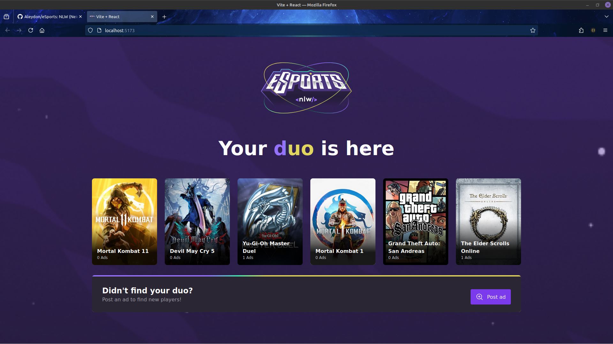
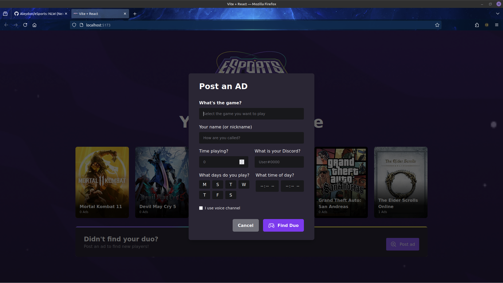

<h2 align='center'>:video_game: eSports :video_game:</h2>

## :pushpin: Requirements: :pushpin:

NodeJs: :link: https://nodejs.org/en/

---

#### :arrow_forward: Get Started:

1. Clone this repo

```sh
git clone https://github.com/Aleydon/eSports.git
```

2. Install NPM packages

```sh
npm install or yarn install
```

3.  Run this project

```sh
npm run dev or yarn dev
```

---

<h2 align="center">Home Page Screenshot</h2>
<p align="center">
  <br>
  
  <br>
  <br>
	<h3>:pushpin:  Fetching Games from api on:  </h3> :link: https://github.com/Aleydon/eSports-backend.git
</p>

<h2 align="center">Screenshot of the Banner/Modal to create ads of which games you play.</h2>
<p align="center">
  <br>
  
  <br>
  <br>
</p>
